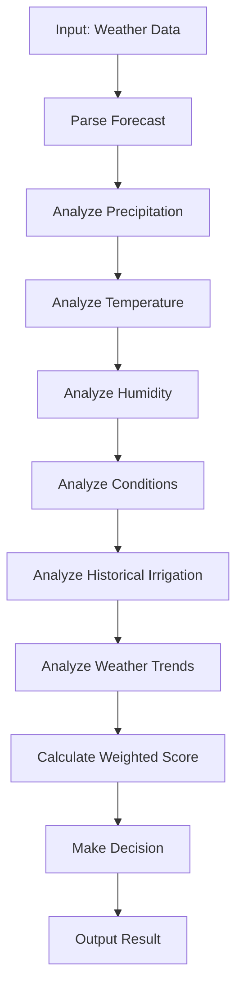

# Decision-Making Algorithm

## Overview
The irrigation decision algorithm analyzes weather data to determine whether irrigation is needed for each valve. The algorithm considers multiple weather factors to make intelligent decisions. It now incorporates historical irrigation duration data and weather trends from recent and upcoming days to improve decision accuracy.

## Algorithm Components

### 1. Data Sources
- Current weather conditions (fetched using `/data/2.5/weather` endpoint)
- 5-day weather forecast (fetched using `/data/2.5/forecast` endpoint)
- Historical weather patterns (stored in database)
- Historical irrigation duration data (stored in database)
- System configuration settings

### 2. Weather Factors Analysis

#### Precipitation Probability
- Analyze forecast for rain/snow in next 5 days
- Calculate probability of precipitation (PoP)
- If PoP > 70% in next 24-48 hours, skip irrigation
- Consider intensity of precipitation (light, moderate, heavy)
- Analyze recent precipitation history (last 3 days) to assess soil moisture

#### Temperature Analysis
- Monitor temperature trends
- High temperatures (above 25°C) increase evaporation
- Low temperatures may reduce irrigation needs
- Consider daily high/low temperature ranges
- Analyze recent temperature trends (last 3 days) to understand climate patterns
- Consider how temperature affects irrigation needs based on recent history

#### Humidity Levels
- Low humidity (below 40%) increases water loss
- High humidity (above 70%) reduces evaporation
- Analyze humidity trends over 5 days
- Analyze recent humidity trends (last 3 days) to understand atmospheric conditions
- Consider how humidity affects irrigation needs based on recent history

#### Weather Conditions
- Clear skies increase evaporation
- Cloudy conditions reduce evaporation
- Wind speed affects water loss
- Atmospheric pressure changes
- Analyze recent weather condition trends to understand environmental factors

### 3. Decision Logic

#### Scoring System
Each factor is assigned a score from 0-100:
- Precipitation probability: 0-100 (inverse relationship)
- Temperature: 0-100 (based on optimal range)
- Humidity: 0-100 (based on optimal range)
- Weather conditions: 0-100 (based on evaporation impact)
- Historical irrigation duration: 0-100 (based on recent usage patterns)
- Recent weather trends: 0-100 (based on environmental pattern analysis)

#### Weighted Calculation
Final irrigation score = (Precipitation × 0.3) + (Temperature × 0.15) + (Humidity × 0.15) + (Conditions × 0.15) + (Irrigation Duration × 0.15) + (Weather Trends × 0.1)

#### Thresholds
- Score < 25: Irrigation highly recommended
- Score 25-50: Irrigation recommended with caution
- Score > 50: Irrigation not recommended

### 4. Implementation Details

#### Algorithm Class
- WeatherAnalyzer class
- Methods for each weather factor analysis
- Combined decision-making method
- Configuration management
- Historical data analysis methods

#### Input Processing
1. Parse 5-day forecast data
2. Extract relevant weather metrics
3. Calculate daily averages
4. Determine precipitation probability
5. Apply weighting factors
6. Retrieve historical irrigation duration data for last 7 days
7. Analyze recent weather trends from last 7 days
8. Calculate historical irrigation patterns

#### Output
- Decision for each valve (True/False for irrigation)
- Reasoning for the decision
- Confidence level of decision
- Next scheduled irrigation time
- Historical data used in decision

### 5. Decision Factors in Detail

#### Precipitation Analysis
- Look for rain/snow in next 24-48 hours
- Consider precipitation intensity
- Calculate cumulative precipitation probability
- If precipitation > 10mm in 24 hours, skip irrigation
- Analyze recent precipitation history to assess soil moisture

#### Temperature Impact
- Optimal range: 15-25°C
- Below 10°C: Reduced evaporation
- Above 30°C: Increased evaporation
- Temperature trend analysis
- Analyze recent temperature trends to understand climate patterns

#### Humidity Impact
- Optimal range: 40-70%
- Below 30%: High evaporation
- Above 80%: Low evaporation
- Humidity trend analysis
- Analyze recent humidity trends to understand atmospheric conditions

#### Weather Conditions Impact
- Clear skies: +20 to evaporation score
- Partly cloudy: +10 to evaporation score
- Overcast: 0 to evaporation score
- Rainy: -330 to evaporation score

#### Historical Irrigation Duration Analysis
- Analyze irrigation duration patterns from last 7 days
- If valves have been active recently, soil may be moist
- If valves have been inactive recently, soil may be dry
- Adjust irrigation recommendation based on recent usage patterns
- Consider duration of previous irrigation sessions

#### Weather Trends Analysis
- Analyze temperature and humidity trends over last 3-7 days
- Identify patterns in weather conditions
- Adjust irrigation decisions based on environmental trends
- Consider how recent weather patterns affect current irrigation needs

### 6. Edge Cases Handling

#### API Failures
- If weather data unavailable, use last known data
- Apply default irrigation schedule
- Log error for system monitoring

#### Data Gaps
- If forecast data incomplete, make conservative decisions
- Use historical averages for missing data points
- Flag for manual review
- If historical irrigation data unavailable, use default duration values

#### System Errors
- Handle invalid data gracefully
- Apply default values when needed
- Maintain system stability
- If database connection fails, use cached data or default values

### 7. Configuration Options

#### Sensitivity Settings
- Adjust weightings for different factors
- Modify irrigation thresholds
- Configure minimum precipitation threshold
- Set sensitivity for historical irrigation duration analysis
- Configure sensitivity for weather trend analysis

#### Time Windows
- Define how far in advance to look for precipitation
- Set time windows for temperature/humidity analysis
- Configure decision refresh intervals
- Define how many days of historical irrigation data to consider
- Define how many days of weather trend data to analyze

### 8. Logging and Auditing

#### Decision Logs
- Store each decision with reasoning
- Include input data used for decision
- Log confidence levels
- Track decision outcomes

#### Performance Metrics
- Track decision accuracy over time
- Monitor system performance
- Generate reports for optimization

### 9. Example Decision Process

1. **Input**: 5-day forecast data for Bucharest
2. **Precipitation Analysis**: 20% chance of rain tomorrow, 5mm precipitation in last 24 hours
3. **Temperature Analysis**: Average 22°C with high of 28°C, 3-day trend showing increasing temperatures
4. **Humidity Analysis**: Average 60% with low of 45%, 3-day trend showing decreasing humidity
5. **Conditions Analysis**: Mostly clear skies
6. **Historical Irrigation Analysis**: Valves were active for 15 minutes each in last 3 days
7. **Weather Trends Analysis**: Recent weather patterns show increasing temperature and decreasing humidity
8. **Combined Score**: 42 (moderate irrigation needed)
9. **Final Decision**: Proceed with irrigation (score 42 < 50 threshold)

### 10. Decision-Making Flowchart

